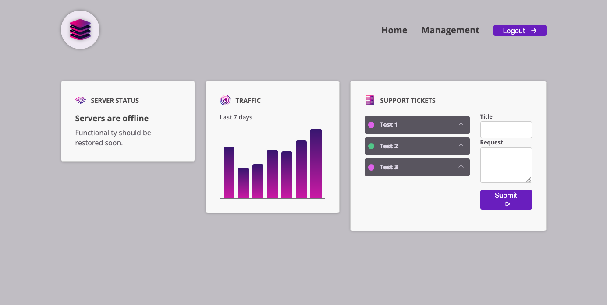

# CmpDeepDive

This project was generated with [Angular CLI](https://github.com/angular/angular-cli) version 18.0.0-next.2.

## Overview

`CmpDeepDive` is a small Angular dashboard demo built with standalone components. It showcases a compact management-style interface with reusable UI building blocks, simple local state handling, and a support ticket workflow.

## What This Project Can Do

- Display a dashboard made of reusable card-style sections.
- Show a server status panel that updates between online, offline, and unknown states.
- Render a simple traffic chart for the last 7 days.
- Let users create support tickets with a title and request message.
- Expand ticket details and mark tickets as completed.

## Main Components

- `HeaderComponent`: renders the top navigation and logout action.
- `DashbpardItemComponent`: reusable wrapper for each dashboard card.
- `ServerStatusComponent`: displays the current server state.
- `TrafficComponent`: renders the traffic bars and summary label.
- `TicketsComponent`: manages the ticket list and ticket state updates.
- `NewTicketComponent`: provides the form for creating new tickets.
- `TicketComponent`: displays each ticket, toggles details, and closes tickets.
- `ButtonComponent`: shared styled button used across the UI.
- `ControlComponent`: shared form control wrapper for labeled inputs and textareas.

## Screenshot

## Development server

Run `ng serve` for a dev server. Navigate to `http://localhost:4200/`. The application will automatically reload if you change any of the source files.

## Code scaffolding

Run `ng generate component component-name` to generate a new component. You can also use `ng generate directive|pipe|service|class|guard|interface|enum|module`.

## Build

Run `ng build` to build the project. The build artifacts will be stored in the `dist/` directory.

## Running unit tests

Run `ng test` to execute the unit tests via [Karma](https://karma-runner.github.io).

## Running end-to-end tests

Run `ng e2e` to execute the end-to-end tests via a platform of your choice. To use this command, you need to first add a package that implements end-to-end testing capabilities.

## Further help

To get more help on the Angular CLI use `ng help` or go check out the [Angular CLI Overview and Command Reference](https://angular.io/cli) page.
